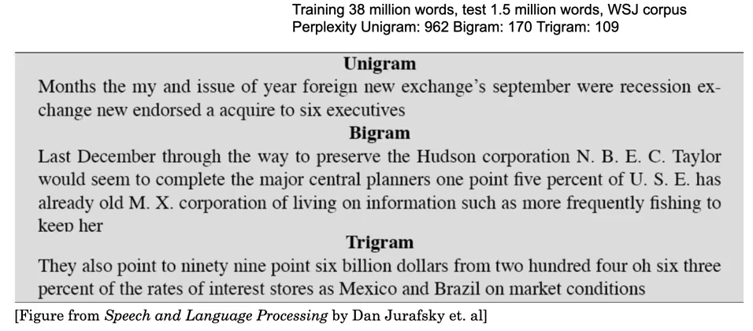

# E2A9

# Precision, Recall, and F1 Scores (END2_Assign_9_P1.ipynb)

## Definitions

True Positives (TP) : 'True' Predictions given that they belong to the 'True' class

True Negatives (TP) : 'False' Predictions given that they belong to the 'False' class

False Positives (FP) : 'True' Predictions given that they belong to the 'False' class

False Negatives (FP) : 'False' Predictions given that they belong to the 'True' class


**Precision**  
Precision is the ratio of correctly predicted positive observations to the total predicted positive observations.


**Recall**  
 Recall is the ratio of correctly predicted positive observations to the all observations in actual positive class.
 


**F1**  
F1 Score is the weighted average of Precision and Recall.


<!--- 
$$\text{Precision} = \frac{TP}{TP + FP}$$

$\text{Recall} = \frac{TP}{TP + FN}$

$\text{F1} = 2 * \frac{\text{Precision} \ * \ \text{Recall}}{\text{Precision} + \text{Recall}}$
-->


## Task

For the demonstration, we have used the notebook from Session 3 but without the addition task. Also, to make the interpretation of the scores easier, we have turned the task into a binary classification problem by categorizing the digits as even or odd. This has been done using the following code

```python
def ev(x):
	if x%2 == 0:
		return 1
	else:
		return 0
	
train_dataset.targets.apply_(ev)
test_dataset.targets.apply_(ev)
```

The number of classes have been reduced to 2 (0 or 1).

## Training logs


# BLEU Scores (END2_Assign_9_P2.ipynb)

It stands for **B**i**L**ingual **E**valuation **U**nderstudy.

It evaluates the quality of machine translation by comparing it with (one or more) ’reference’ translations. It computes two parameters
- clipped precision
- brevity penalty


### Clipped Precision (or N-Gram Overlap)
It is a measure of how much the 'candidate' (prediction) translation matches the 'reference' (actual, human-translated) translation. Steps:
- Consider unigram sequences
- Initialize a counter for the unigrams (for both predicted and actual translation). Note that the counter has unique keys only. All values are counts.
- For each word in the prediction, check if it is in the actual translation.
  - If it is absent, set the value to 0 (in the prediction key)
  - If it is present, ensure that the actual translation’s count is less than or equal to the prediction count. ’Clip’ if needed.
- Sum all the unigram scores of the prediction and divide by the total number of words in the prediction.
- Repeat this for bigrams, trigrams, and 4-grams.
- Weight all the scores equally with their logarithms.
- Sum the result and then take the exponent

```python
def clipped_precision(target, prediction):

    clipped_precision_score = []

    for i in range(1, 5):
        prediction_n_gram = Counter(ngrams(prediction, i))  
        target_n_gram = Counter(ngrams(target, i))  

        c = sum(prediction_n_gram.values())  

        for j in prediction_n_gram:  
            if j in target_n_gram: 

                if (prediction_n_gram[j] > target_n_gram[j] ):  
                    prediction_n_gram[j] = target_n_gram[j]  
            else:
                prediction_n_gram[j] = 0  # else reference n-gram = 0

        clipped_precision_score.append(sum(prediction_n_gram.values()) / c)

    weights = [0.25] * 4
    cl = np.array(clipped_precision_score)
    w = np.array(weights)

    s1 = w * np.log(cl)

    s = np.exp(np.sum(s1))
    return s
```

### Brevity Penalty
This penalizes the scores if the length of the prediciton is not longer than the actual sentence's length by a factor
<!--- 
$\text{BP} =\exp\bigg(1 - \frac{\text{actual length}}{\text{prediction length}}\bigg)$
-->


```python
def brevity_penalty(target, prediction):
    targ_length = len(target)
    pred_length = len(prediction)

    if  pred_length > targ_length:
        BP = 1
    else:
        penalty = 1 - (targ_length / pred_length)
        BP = np.exp(penalty)

    return BP
```

Finally, the BLEU scores are calculated as 

```python
def bleu_score(target, prediction):
    BP = brevity_penalty(target, prediction)
    precision = clipped_precision(target, prediction)
    return BP * precision
```


## Interpretation


## Code Modification
In order to calculate the BLEU scores (after every epoch during training), the testing loop had to be modified. The output from the model was converted from indices to tokens, and these tokenized sentences were stored in a list.

## BLEU logs


# Perplexity

It is a measure of how complex a sentence is. A well-translated (perfect) sentence/translation will have a lower perplexity score; a 'bad' translation will have a higher perplexity score. Thus, unlike the previous measures, lower is better.

It is calulated as 

where
- N is the length of the sentence
- n is the number of words in the n-gram (e.g. 2 for a bigram).
- P is the conditional probability of a word appearing after a given n-gram sequence


## Interpretation/Evaluation
As stated, lower perplexity score is better. The following texts were all generated using the same corpus, but different n-gram sequences. Trigram model had the lowest perplexity (and the most clarity in meaning).



# BERTScore (END2 - Assign 9_P4.ipynb)

## Definition
BERTScore leverages the pre-trained contextual embeddings from BERT and matches words in candidate and reference sentences by cosine similarity. The `bert_score` function returns the Precision, Recall, and F1 Score for the samples, after which its average can be found using the `.mean()` method. 

All three metrics (BERT P, BERT R, and BERT F1) have been reported in the notebook
## Evaluation


## Training logs


